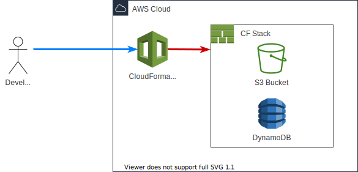

# S3 Bucket for Terraform tfstate 

You can create the backend resources ( S3 & DynamoDB ) for terraform using this template.



## Setup

```sh
brew install awscli
```

## How to Use

```sh
aws cloudformation create-stack \
    --profile ${profile_name}
    --stack-name ${stack_name} \
    --template-body file://${templatefile_path} \
    --parameters $params
```
